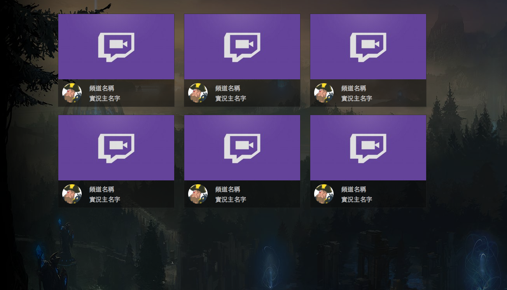

# Homework 1

## 作業名稱
基本 HTML/CSS 練習：以 Twitch 為例

## 作業說明
[Twitch](https://www.twitch.tv/) 是一間專門做遊戲直播的公司（但近期有想要跨到其他領域去），之前被 Amazon 收購。  
這系列的作業會以 Twtich 為例子，嘗試做出裡面一些簡單的頁面。而第一次作業就是要以 Twitch 的遊戲畫面為例，模仿出類似的介面。  
讓我們先來看看 Twitch 的介面：

再來看看這次作業要做出的成果：

作業成果圖只是示意最後做出來的樣子，但詳細內容，例如說字體大小、padding、margin 等參數憑感覺調整即可，不一定要跟示意圖相同（但也不能相差太多）

## 作業規格

1. 每一個方格的寬度為 300 px，高度不限，但每個方格的高度必須一樣
2. 上面為遊戲瀏覽畫面，圖片可以用[這張](https://static-cdn.jtvnw.net/previews-ttv/live_user_wayne75525-320x180.jpg)
3. 下面左邊是實況主的大頭貼，可以先用[這張](https://static-cdn.jtvnw.net/jtv_user_pictures/fate_twisted_na-profile_image-f51be41c0c37cf65-300x300.jpeg)代替
4. 一排有三個方格
5. 不需做 RWD，可以直接假設螢幕寬度會在 1000 px 以上
6. 背景圖片可以用[這張](http://cdn.leagueoflegends.com/lolkit/1.1.6/resources/images/bg-default.jpg)
7. 因為背景圖片太亮，所以背景圖片上面必須疊一層透明度為 50% 的黑色
8. 背景圖片必須保持不動（`background-attachment: fixed`）
9. 作業成品需要有九個方格，你可以做完一個之後複製九遍即可
10. 必須可以滾動

示意圖：

## 作業規範

1. 禁止使用任何 CSS framework（例如說 bootstrap），請自己手刻 CSS
2. 可以使用 CSS preprocessor 如 Sass, Less, Stylus 等（如果你不會用也沒關係）

## 學習資源

1. [html & css is hard, But it doesn’t have to be](https://internetingishard.com/html-and-css/)
2. [MarkSheet: A free HTML & CSS tutorial](http://marksheet.io/)
3. [Learn to Code HTML & CSS](http://learn.shayhowe.com/html-css/)
4. [Google](https://google.com)

## 自我練習

1. 請問 CSS 的屬性`position`有哪幾種值？
2. 承上，請問那幾種值有哪些區別？請講出適合應用的地方。
3. `display`的三個值`inline`, `block`, `inline-block`有什麼異同？可以試著舉出幾個例子嗎？
4. 有哪些 HTML 元素是 `inline`, 哪些是 `block`？
5. 當我設定一個元素的`width`為`300px`，並且`padding`設成`10px`之後，這個元素的寬度應該會是多少？
6. 這次實作的畫面當頻道名稱字太多的時候，會超出一格的大小或者會直接被卡掉，有沒有辦法讓字太多的時候在尾巴顯示`...`？例如原本名稱叫做：「1234567」，顯示的時候變成：「12345...」？

## 進階閱讀

1. [A Complete Guide to Flexbox](https://css-tricks.com/snippets/css/a-guide-to-flexbox/)
2. [學習 CSS 版面配置: flexbox](http://zh-tw.learnlayout.com/flexbox.html)
3. [深入解析 CSS Flexbox](http://www.oxxostudio.tw/articles/201501/css-flexbox.html)

