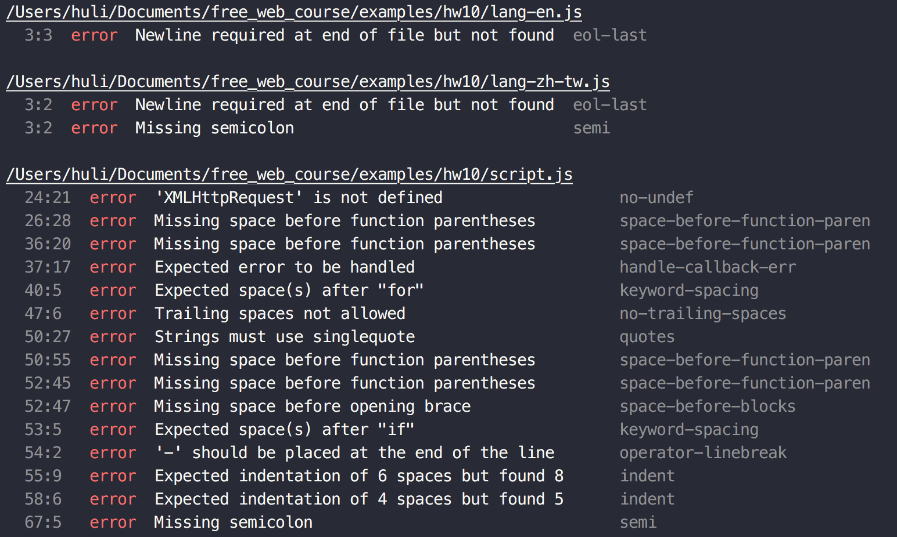

# Homework 10

## 作業名稱

改掉你的壞習慣：ESLint 與 standard

## 作業說明

雖然大多數時間你可能都是一個人寫 code，但難免會碰到需要跟其他人協作的時候  
尤其是在工作上通常都是團隊合作，每個人都負責某一個專案的一小部分

這時候，有一個東西就顯得格外重要：coding style  
如果你同事變數風格是`thisIsVariable`而你是`this_is_variable`，那程式碼看起來就相當雜亂  
因此呢，這一個作業希望讓大家把自己的壞習慣改一改，強迫自己按照一樣的風格進行開發

實際上怎麼做呢？當然就是靠現成工具來幫助我們囉，目前比較多人支持的工具有兩套  
第一套叫做[ESLint](http://eslint.org/)，可以幫我們檢查語法錯誤跟 coding style，通常搭配[airbnb 的規範](https://github.com/airbnb/javascript)一起使用  
第二套叫做[standard](https://github.com/feross/standard)，與 ESLint 最大的不同點在於：standard 的規範是死的，所以沒有設定檔，強迫大家都用預設的設定。

安裝完成之後，可以用這些工具去檢測自己的程式碼有沒有違反規範，你看我的就違反一大堆...

檢測完之後，就可以開始乖乖按照上面說的，把自己的程式碼整理乾淨

## 作業規格

1. 在 ESLint 與 standard 兩套裡面挑一套使用並通過檢測
2. 如果你喜歡分號，也歡迎使用分號版的[semistandard](https://github.com/Flet/semistandard)

## 作業規範

1. 讓所有 js 檔案通過檢測即可
2. 這週的作業我不會改（因為也沒什麼好改的），但麻煩大家通過之後還是交一下作業，我想統計一下一些數字，感謝

## 學習資源

1. [淺入淺出 eslint 與實作](https://denny.qollie.com/2016/07/11/eslint-fxcking-setup/)
2. [[ESLint 學習筆記] Applying ESLint - Using Atom & linter-eslint](https://amobiz.github.io/2015/12/21/applying-eslint-using-atom-linter-eslint/)
3. [JavaScript Standard Style ](https://standardjs.com/readme-zhtw.html)
4. [standard JS 代码规范和提交代码时检查](http://yanxi.me/2017/02/05/standardjs-precommit/)

## 自我練習

無

## 進階閱讀

無
