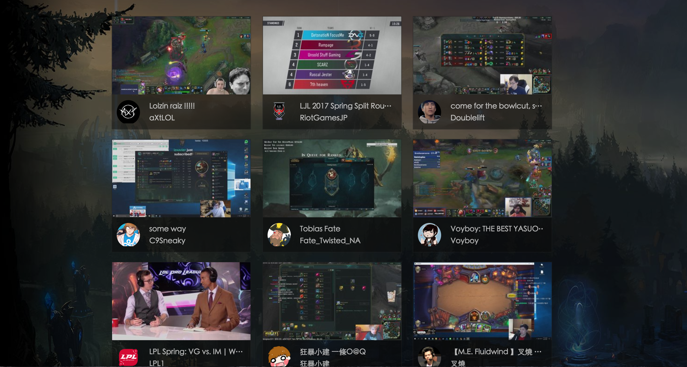

# Homework 4

## 作業名稱

從假資料到真資料：Ajax 與 API 串接

## 作業說明

直到目前為止，我們的資料都還是自己手寫在 HTML 裡面的，但是對一個實況網站來說，這樣子一點用都沒有。因此，我們需要真正的資料，並且在拿到資料以後轉成 HTML 並且顯示出來。

那具體上要怎麼做呢？從上面的敘述，你可以看出兩件事。

1. 要有辦法寫 code 跟某個地方拿資料並且做處理
2. 要有地方讓你拿資料

第一點指的就是`ajax`，你可以透過`ajax`在網頁前端利用 JavaScript 去跟某個地方拿資料，那其實這個「某個地方」指的就是 API。Twitch 有把自己的 API 開放出來，讓想開發的開發者們可以自己串接真的資料。

## 作業規格

1. [Twitch API](https://dev.twitch.tv/docs)裡面有一個 API 是可以拿到現在正在直播的某個遊戲底下的資料，API 的描述是「Gets a list of live streams.」，看到這行就代表你找對 API 了。
2. API 要帶的參數有一個 `game` 的欄位，請帶`League%20of%20Legends`
3. 請顯示 20 個實況，不多不少，要剛好 20 個

完成示意圖：

## 作業規範

1. 除了 `jQuery`，不能用其他的 Library

## 學習資源

1. jquery ajax
2. jquery append
3. ajax
4. [HTTP access control (CORS)](https://developer.mozilla.org/zh-TW/docs/Web/HTTP/Access_control_CORS)

## 自我練習

1. HTTP method 有哪幾個？有什麼不一樣？
2. `GET` 跟 `POST` 有哪些區別，可以試著舉幾個例子嗎？
3. 什麼是 RESTful API？
4. JSON 是什麼？
5. JSONP 是什麼？
6. 要如何存取跨網域的 API？

## 進階閱讀

1. [簡明RESTful API設計要點](https://tw.twincl.com/programming/*641y)
2. [浏览器同源政策及其规避方法](http://www.ruanyifeng.com/blog/2016/04/same-origin-policy.html)
3. [跨域资源共享 CORS 详解](http://www.ruanyifeng.com/blog/2016/04/cors.html)